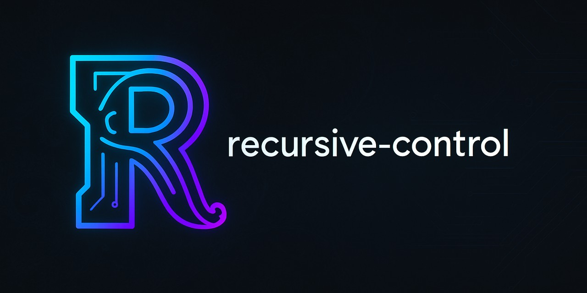

<picture>  
   
</picture>

<h1 align="center">📎 AI Control for Windows Computers 📎</h1>

[](https://discord.gg/mQWsWeHsVU)

Recursive Control is an innovative project designed to enable artificial intelligence (AI) to interact seamlessly with your computer, automating tasks, performing complex workflows, and enhancing productivity.

## Project Goal

Our mission is to create an AI-driven interface that can autonomously control your computer, intelligently perform tasks, open applications, execute commands, and streamline workflows, effectively turning natural language into actionable operations.

## Features

- **AI-Powered Interaction**: Utilize AI models (such as GPT-based models) to interpret user input and intelligently execute actions.
- **Automated Workflow Execution**: Automate repetitive or complex sequences of computer actions.
- **Natural Language Commands**: Simply describe tasks in plain language, and let the AI handle execution.

## Getting Started

### Prerequisites

- .NET 4.8 or later
- Windows Operating System
- Azure OpenAI API Key (More models will be supported in the future)

### Local Setup

Download the latest release from the [Releases](https://github.com/flowdevs-io/Recursive-Control/releases) page and follow three easy steps.

1. Run recursivecontrol.exe
2. Setup your LLM 

3. Input your commands directly into the UI, and watch as AI automate your tasks.


### Development

1. Clone this repository:
   ```bash
   git clone https://github.com/flowdevs-io/Recursive-Control.git
   ```

2. Navigate to the cloned directory:
   ```bash
   cd Recursive-Control
   ```

3. Restore dependencies and build the project:
   ```bash
   dotnet restore
   dotnet build
   ```

## Plugin System

Recursive Control supports a modular plugin system, allowing you to extend its capabilities. Plugins can automate keyboard, mouse, window management, screen capture, command line, and more. You can find plugin implementations in the `FlowVision/lib/Plugins/` directory. To add your own plugin, implement the required interface and register it in the application.

### Built-in Plugins
- **CMDPlugin**: Execute Windows command line instructions.
- **PowershellPlugin**: Run PowerShell scripts and commands.
- **KeyboardPlugin**: Automate keyboard input.
- **MousePlugin**: Automate mouse actions.
- **ScreenCapturePlugin**: Capture screenshots.
- **WindowSelectionPlugin**: Select and interact with application windows.
- **PlaywrightPlugin**: Automate web browsers using Playwright. Use `LaunchBrowser` to start, `ExecuteScript` to run JavaScript, and `CloseBrowser` when finished.


## Folder Structure

```
FlowVision.sln                # Solution file
FlowVision/                   # Main application source
  lib/                        # Core libraries and plugins
    Classes/                  # Helper and service classes
    Plugins/                  # Built-in plugins
    UI/                       # UI theming
  Models/                     # Data models
  Properties/                 # .NET project properties
content/                      # Images and assets
```

## Codebase Overview

**General Structure**

- The project is a Windows Forms application targeting .NET 4.8. The solution (`FlowVision.sln`) loads a single project `FlowVision`.
- `Program.cs` contains the entry point, which starts `Form1`.
- Core logic lives under `FlowVision/lib/Classes/` and `FlowVision/lib/Plugins/`.
- Plugins include modules such as `CMDPlugin`, `KeyboardPlugin`, `MousePlugin`, and screen-capture tools.
- Configuration classes (`APIConfig`, `ToolConfig`, etc.) store user settings under `%APPDATA%\FlowVision\...` for persistence.

**Important Components**

- **Plugin System** – Explained above; it allows extending the toolset with keyboard/mouse automation, window management, PowerShell, etc. Plugins are stored in `FlowVision/lib/Plugins/`.
- **ToolConfig** – Holds feature toggles and prompt templates. Default values and prompts are defined here.
- **MultiAgentActioner** – Implements a multi-agent workflow using Semantic Kernel to coordinate a "coordinator," "planner," and "executor" agent.
- **User Interface** – `Form1` presents a chat-like UI with text and speech input, uses `ThemeManager` for light/dark themes, and logs plugin operations using `PluginLogger`.

**Getting Started**

The README provides prerequisites, setup instructions, and folder layout.

**Pointers for Next Steps**

1. **Explore Plugin Development** – Each plugin class uses Semantic Kernel's `[KernelFunction]` attributes to expose commands. Creating new plugins or modifying existing ones is a good way to extend functionality.
2. **Review Multi-Agent Logic** – `MultiAgentActioner` demonstrates coordinating multiple models/agents. Understanding its workflow helps when adapting the app to other LLMs or custom behaviors.
3. **Understand Configuration Handling** – Look into how `ToolConfig` and `APIConfig` store settings in JSON files under `%APPDATA%`. Learning this pattern is important for customizing the tool for different environments.
4. **UI Customization** – The `ThemeManager` and `MarkdownHelper` classes show how theming and markdown rendering are done. This is useful if you want to adapt the interface.
5. **Security and Logging** – Read `SECURITY.md` for guidelines on reporting issues and inspect `PluginLogger` for how plugin usage is tracked.


## Example Use Cases
- Control applications via natural language (e.g., "Open Excel and create a new spreadsheet")
- Capture and process screenshots for documentation
- Batch rename files or organize folders
- Use PlaywrightPlugin to automate websites, e.g., `LaunchBrowser`, `NavigateTo`, then `ExecuteScript("return document.title;")` to read the page title

## Roadmap

### Near-Term Goals
- [ ] **Content warning logging**: Implement logging for content warnings to improve safety and transparency.
- [ ] **Model Support**: Add support for Gemini, OLLAMA, OpenAI, Bedrock, Phi4, and Phi Silica models.
- [ ] **Improved Speech Recognition**: Move away from System.Speech.Recognition (which is slow and inaccurate for voice commands) and adopt real-time audio models from OpenAI or similar providers.

### Farther Out
- [ ] **Local Bbox Search**: Reduce token usage by integrating Bbox search locally (using OLLAMA, Phi Silica, or other novel SLMs).
- [ ] **Managed LLM Integration**: Develop Recursive Control managed LLM for non-user configurable integration, enabling billing for usage or subscription plans.
- [ ] **YOLO Bbox Parser Integration**: Integrate Yolo Bbox parser using ONNX for advanced vision capabilities.

### End Goal
Recursive Control running on every Windows computer, leveraging local SLMs, Recursive Control hosted LLMs, and embedded YOLO vision models. The ultimate aim is to make the integration so seamless that new PC users will no longer need a keyboard or mouse—just interact with the latest LLM, and it will turn words into commands. So easy our elders will even use it.

## Troubleshooting
- Ensure you have .NET 4.8+ installed
- Check your API key and network connection for LLM access
- For plugin errors, review the application logs in %appdata%\FlowVision\plugin_usage.log

## Contributing

We welcome contributions! Please feel free to submit issues, suggestions, or pull requests. Your collaboration is essential for making Recursive Control powerful and versatile.

## Community & Support
- [GitHub Issues](https://github.com/flowdevs-io/Recursive-Control/issues) for bug reports and feature requests
- [Discussions](https://github.com/flowdevs-io/Recursive-Control/discussions) for Q&A and ideas
- [LinkedIn](https://www.linkedin.com/company/flowdevs) for updates and networking

## License

This project is licensed under the MIT License - see the [LICENSE](LICENSE) file for details.

## Contact

For any questions, feedback, or collaboration inquiries, please connect with us through our GitHub repository,  or via LinkedIn.

## Citation

If you use Recursive Control in your research or project, please cite:

```bibtex
@software{recursive-control2025,
  author = {Trantham, Justin},
  title = {Recursive Control: AI Control for Windows Computers },
  year = {2025},
  publisher = {GitHub},
  url = {https://github.com/flowdevs-io/Recursive-Control}
}
```
<div align="center">
Made and owned by Engineers
</div>
