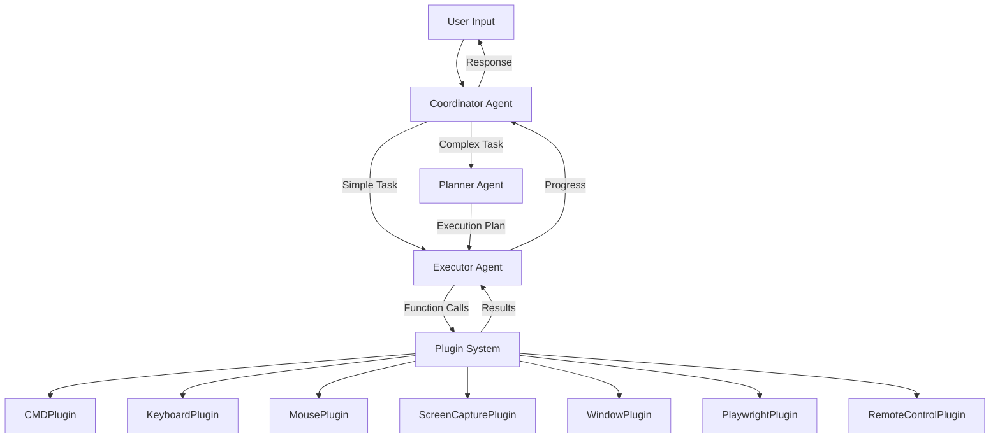

# Multi-Agent Architecture

Deep dive into Recursive Control's sophisticated 3-agent system.

## Overview

Recursive Control uses a multi-agent architecture inspired by modern AI orchestration patterns. Instead of a single AI handling everything, specialized agents work together to understand, plan, and execute tasks more effectively.

## The Three Agents

### 1. Coordinator Agent 🎯

**Role**: Traffic controller and request router

**Responsibilities**:
- Receives and analyzes user requests
- Determines request complexity
- Routes simple tasks directly to executor
- Delegates complex tasks to planner
- Maintains conversation context

**Example Flow**:
```
User: "What time is it?"
Coordinator: [Direct response, no plugins needed]

User: "Open Chrome, search for AI news, and summarize the top 3 articles"
Coordinator: [Routes to Planner - complex multi-step task]
```

### 2. Planner Agent 📋

**Role**: Strategic task decomposition

**Responsibilities**:
- Breaks complex requests into steps
- Identifies required plugins
- Creates execution sequence
- Handles dependencies between steps
- Anticipates potential issues

**Example Plan**:
```
Task: "Download images from a website and organize them by date"

Plan:
1. Use PlaywrightPlugin to launch browser
2. Navigate to specified website
3. Execute JavaScript to find all image URLs
4. Use CMDPlugin to create date-based folders
5. Download images to appropriate folders
6. Close browser
7. Verify downloads completed
```

### 3. Executor Agent ⚙️

**Role**: Action performer

**Responsibilities**:
- Executes plans step-by-step
- Calls appropriate plugins with correct parameters
- Handles errors and retries
- Reports progress and results
- Adapts when unexpected issues arise

**Example Execution**:
```
Step 1: PlaywrightPlugin.LaunchBrowser("chromium")
Status: ✅ Browser launched

Step 2: PlaywrightPlugin.NavigateTo("https://example.com")
Status: ✅ Navigated successfully

Step 3: PlaywrightPlugin.ExecuteScript("return document.images.length")
Status: ✅ Found 42 images
...
```

## Architecture Diagram



## Communication Flow

### Simple Request Flow

```
User: "Take a screenshot"
    ↓
Coordinator: Analyzes request (simple, direct action)
    ↓
Executor: Calls ScreenCapturePlugin.CaptureScreen()
    ↓
Plugin: Captures screen, returns image path
    ↓
Executor: Reports success
    ↓
Coordinator: Formats response for user
    ↓
User: "Screenshot saved to C:\Users\...\screenshot.png"
```

### Complex Request Flow

```
User: "Automate my morning routine: check email, read headlines, generate summary"
    ↓
Coordinator: Identifies complexity, routes to Planner
    ↓
Planner: Creates multi-step plan
    1. Launch browser
    2. Navigate to email
    3. Extract unread count
    4. Navigate to news site
    5. Scrape headlines
    6. Generate summary
    ↓
Executor: Executes plan step-by-step
    - Uses PlaywrightPlugin for web automation
    - Handles each step sequentially
    - Reports progress after each step
    ↓
Coordinator: Compiles results, formats summary
    ↓
User: Receives comprehensive summary
```

## Agent Prompts

Each agent has a specialized system prompt that defines its behavior.

### Coordinator Prompt (Simplified)

```
You are the Coordinator Agent for Recursive Control.

Your responsibilities:
1. Understand user requests
2. Determine if task is simple (direct) or complex (needs planning)
3. Route requests appropriately
4. Maintain conversation context

For simple tasks: respond directly or invoke executor
For complex tasks: delegate to planner
```

### Planner Prompt (Simplified)

```
You are the Planner Agent for Recursive Control.

Your responsibilities:
1. Analyze complex tasks
2. Break them into sequential steps
3. Identify required plugins for each step
4. Create clear execution plan
5. Consider error handling

Available plugins: [list of plugins]

Output format: JSON array of steps with plugin calls
```

### Executor Prompt (Simplified)

```
You are the Executor Agent for Recursive Control.

Your responsibilities:
1. Execute plans step-by-step
2. Call plugins with correct parameters
3. Handle errors gracefully
4. Report progress
5. Adapt when issues occur

You have access to: [list of plugin functions]

Execute each step and report results.
```

## Plugin Integration

Agents interact with plugins through the Semantic Kernel framework:

```csharp
// Plugins expose functions via attributes
[KernelFunction]
[Description("Capture screenshot of screen")]
public string CaptureScreen() { ... }

// Executor calls plugins
var result = await kernel.InvokeAsync("ScreenCapturePlugin", "CaptureScreen");

// Result returned to agent
return $"Screenshot captured: {result}";
```

## Error Handling

The multi-agent system has sophisticated error handling:

### Retry Logic
```
Step fails → Executor analyzes error
    ↓
If retryable → Attempt again (up to 3 times)
    ↓
If still failing → Report to Coordinator
    ↓
Coordinator → Requests alternative plan from Planner
    ↓
New plan → Executor tries different approach
```

### Graceful Degradation
```
Primary approach fails
    ↓
Planner generates fallback plan
    ↓
Executor attempts fallback
    ↓
If successful: task completed (may be partial)
If unsuccessful: clear error message to user
```

## Performance Optimization

### Token Usage
- Coordinator uses smaller models for routing decisions
- Planner only invoked for complex tasks
- Executor uses function calling to minimize tokens
- Context maintained efficiently across agents

### Parallel Execution
- Independent steps can execute in parallel
- Plugins support async operations
- Non-blocking UI updates

### Caching
- Common plans cached for reuse
- Plugin results cached when appropriate
- Conversation context optimized

## Configuration

### Customizing Agent Behavior

Edit system prompts in `%APPDATA%\FlowVision\toolconfig.json`:

```json
{
  "coordinatorPrompt": "Your custom coordinator prompt...",
  "plannerPrompt": "Your custom planner prompt...",
  "executorPrompt": "Your custom executor prompt...",
  "maxRetries": 3,
  "enableParallelExecution": true
}
```

### Selecting Models

Different models for different agents:

```json
{
  "coordinatorModel": "gpt-3.5-turbo",  // Fast, cheap
  "plannerModel": "gpt-4",               // Smart, strategic
  "executorModel": "gpt-4-turbo"         // Fast + smart
}
```

## Advanced Patterns

### Hierarchical Planning

For very complex tasks:
```
User Request
    ↓
Coordinator → Planner (creates high-level plan)
    ↓
Each high-level step → Planner (creates detailed sub-plan)
    ↓
Executor (executes all sub-steps)
```

### Feedback Loops

Agents can request clarification:
```
Planner: "I need clarification - should I overwrite existing files?"
    ↓
User: "Yes, overwrite them"
    ↓
Planner: Updates plan with overwrite flag
```

### Context Awareness

Agents maintain shared context:
```
User: "Open that file again"
Coordinator: Retrieves "that file" from context (last mentioned file)
Executor: Opens the correct file
```

## Comparison: Single vs Multi-Agent

### Single Agent Approach ❌
- One agent handles everything
- Becomes complex and error-prone
- Difficult to optimize
- Limited scalability

### Multi-Agent Approach ✅
- Specialized agents for each concern
- Clear separation of responsibilities
- Easier to optimize and debug
- Highly scalable
- Better error handling

## Real-World Examples

### Example 1: Web Research Task

```
User: "Research the top 5 AI coding tools and create a comparison table"

Coordinator: Recognizes complexity → Routes to Planner

Planner creates plan:
1. Search for "AI coding tools"
2. Extract top 5 tools
3. For each tool: visit website, gather info
4. Compile data into table format

Executor executes:
- Uses PlaywrightPlugin for web automation
- Gathers information systematically
- Formats results as table

Result: Comprehensive comparison table delivered to user
```

### Example 2: File Organization

```
User: "Organize my Downloads folder by file type"

Coordinator: Routes to Planner

Planner creates plan:
1. Scan Downloads folder
2. Identify file types
3. Create folders for each type
4. Move files to appropriate folders

Executor executes:
- Uses CMDPlugin for file operations
- Creates organized structure
- Reports completion

Result: Organized Downloads folder
```

## Best Practices

### For Users
1. Be clear and specific in requests
2. Break very large tasks into phases
3. Provide context when needed
4. Review plans before execution (if configured)

### For Developers
1. Keep agent prompts focused
2. Test with various task complexities
3. Monitor token usage
4. Optimize plugin performance
5. Implement comprehensive logging

## Future Enhancements

### Planned Features
- [ ] Agent learning from past executions
- [ ] Dynamic agent spawning for parallel tasks
- [ ] Cross-agent memory sharing
- [ ] Advanced planning algorithms
- [ ] User preference learning

## Related Documentation

- [System Prompts Reference](System-Prompts-Reference.html) - Customize agent behavior
- [API Reference](API-Reference.html) - Plugin development
- [UI Features](UI-Features.html) - Interacting with agents

---

Questions about the architecture? Join our [Discord](https://discord.gg/mQWsWeHsVU) for discussions!
